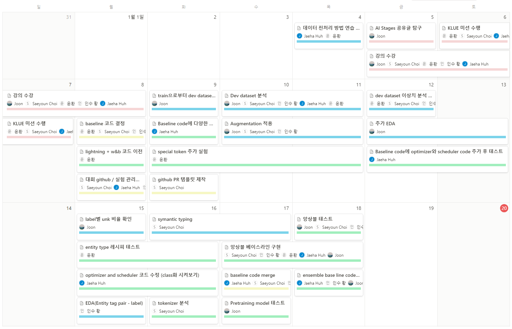
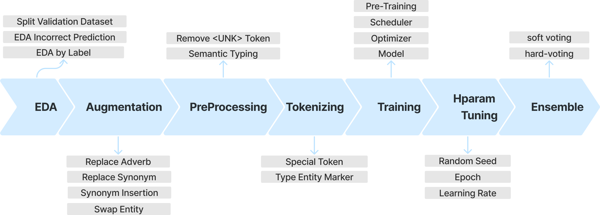

# 🏆**Level2 KLUE Project - Relation Extraction**


## 🖥️ Project Introduction
|**개요**|**Description**|
|:--:|--|
|**주제** | **`Relation Extraction`** : 문장 내 두 개체명 쌍 (entity pair) 간 관계 추출 |
|**목표**| 모델 학습을 통해 `sentence`와 문장 내 두 개체 `subject entity`, `object entity` 간의 관계 분류 |
|**평가 지표**| micro f1 score |
|**데이터**|Train (32470개), Test (7765개) from Wikitree, Wikipedia, Policy_briefing |
|**협업 환경**|**`Notion`**(실험 상황 공유), **`Github`**(코드 버전관리), **`Slack`**(실시간 소통) |


<br>

## 🎖️**Leader Board**
### **🥈Private Leader Board(1위)**


### **🥉Public Leader Board(3위)**


<br>

## 👼**Member's role**
|**Member**|**Role**|
|--|--|
|[**손윤환**](https://github.com/Yunan31)| 전처리 함수 변경, Tokenizing 실험 (Type entity marker, special token 등), 앙상블 baseline 구현 (hard voting)|
|[**최새연**](https://github.com/new-open)|데이터 증강 (동의어 치환/삽입), semantic typing 데이터셋 구축, github 협업 관련 template 제작 (PR, issue)|
|[**허재하**](https://github.com/jaehahuh)|Baseline model code에 기능 추가 및 구현, optimizer and scheduler(AdamP, SGD 등) 구현 및 모델 성능 테스트|
|[**황기중**](https://github.com/merri4)|EDA (label별 오답률 분석, unk 토큰 영향 분석), 데이터 증강 (부사 치환), 모델 실험 (koelectra, funnel, bert), TAPT (roberta-large), 앙상블 baseline 구현 (softmax weighted sum)|
|[**황인수**](https://github.com/In-Soo-Hwang)|EDA (entity pair - label 분표 및 비율 확인), 앙상블 baseline 구현 (mean, weighted sum)|

<br>


## 📅**Project Process**

* 프로젝트는 2024-01-03 ~ 2024-01-18 15일간 진행되었습니다.



<br>

## 🕵️**What we did**



|**Process**|**What we did**|
|:--:|--|
|**Dev Dataset 구축**| 알려진 Test dataset의 label 분포와 유사하게 train data split |
|**EDA**| 레이블별 분포 분석, Baseline 모델 예측과 실제값 차이 정성 분석 |
|**Preprocessing**| subject/object entity 쉼표 처리 |
|**Augmentation**|동의어 치환 (Synonym Replacement), 동의어 삽입 (Synonym Insertion), 부사 치환 (Adverb Replacement), Entity pair swap |
|**Entity Marker**| Entity marker, special token 사용, Typed Entity marker, Type entity marker (punct) |
|**Semantic Typing**| sentence + 관계 질문 추가 |
|**Experiment Model**| roberta-base, roberta-large, koelectra-v3-discriminator, electra-kor-base, funnel-kor-base, bert-base |
|**TAPT**| roberta-large + MLM |
|**Ensemble**| soft voting (mean, weighted sum), hard voting |


<br>


## **📁Directory Structure**

### **📁디렉토리**
* 학습 데이터 경로 : `./data`
* 학습 코드 경로 : `./code`


### **📁📁코드**
1. **데이터 증강** : `./code/augmentation.py`
1. **TAPT** : `./code/prepretraining.py`
1. **학습** : `./code/train.py`, `./code/pl_train.py`
2. **추론** : `./code/inference.py`, `./code/pl_inference.py`
4. **앙상블** : `./code/ensemble.py`

```
📁level2-klue-nlp-12
├─code
│  augmentation.py
│  custom_train.py
│  ensemble.py
│  inference.py
│  load_data.py
│  pl_inference.py
│  pl_train.py
│  prepretraining.py
│  requirements.txt
│  train.py
│          
└─data
   ├─train
   │  train.csv
   │  
   ├─dev
   │  dev.csv
   │  
   ├─test
   │  test_data.csv

```
<br>

## **💻How to Start**

### **환경 세팅**
```
> pip install -r requirements.txt
```


### **📊Pretrain (optional)**
```
> python ./code/prepretraining.py
```

### **🤖Train**
```
> python ./code/train.py
```
또는 
```
> python ./code/pl_train.py
```

### **🤖Infer**

```
> python ./code/inference.py
```
또는 
```
> python ./code/pl_inference.py
```


### **🤖Ensemble**
```
> python ./code/ensemble.py --technique mean
```

<br>


## 📄 Reference

James Y. Huang et al. (2022). "Unified Semantic Typing with Meaningful Label Inference". [arXiv:2205.01826](https://arxiv.org/abs/2205.01826)


Byeongho Heo et al. (2021). "AdamP: Slowing Down the Slowdown for Momentum Optimizers on Scale-invariant Weights". [arXiv:2006.08217](https://arxiv.org/abs/2006.08217)


Wenxuan Zhou and Muhao Chen (2022). "An Improved Baseline for Sentence-level Relation Extraction". [arXiv:2102.01373](https://arxiv.org/abs/2102.01373)


Suchin Gururangan et al. (2020). "Don't Stop Pretraining: Adapt Language Models to Domains and Tasks". [arXiv:2102.01373](https://arxiv.org/abs/2102.01373)

